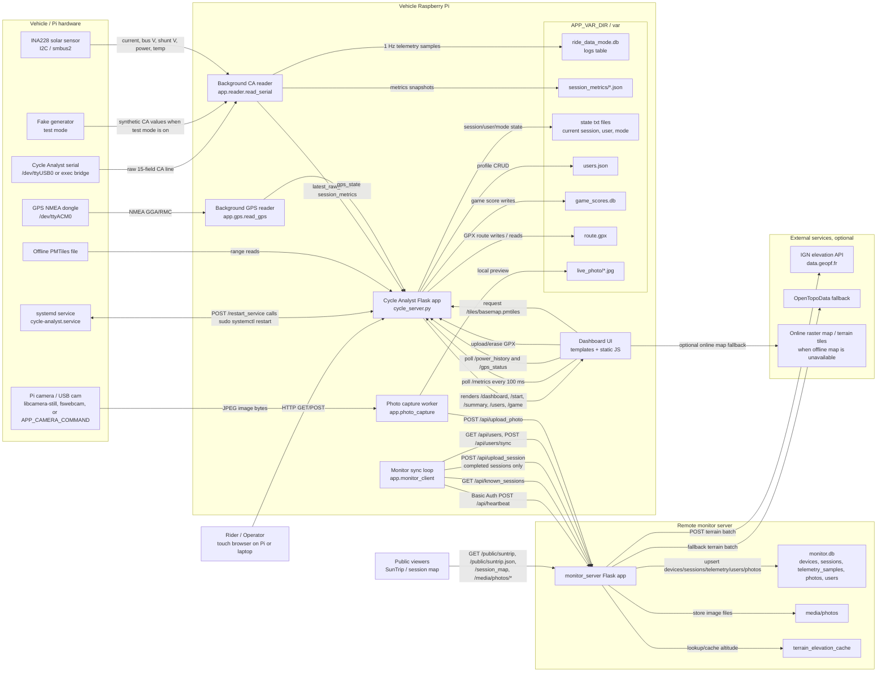
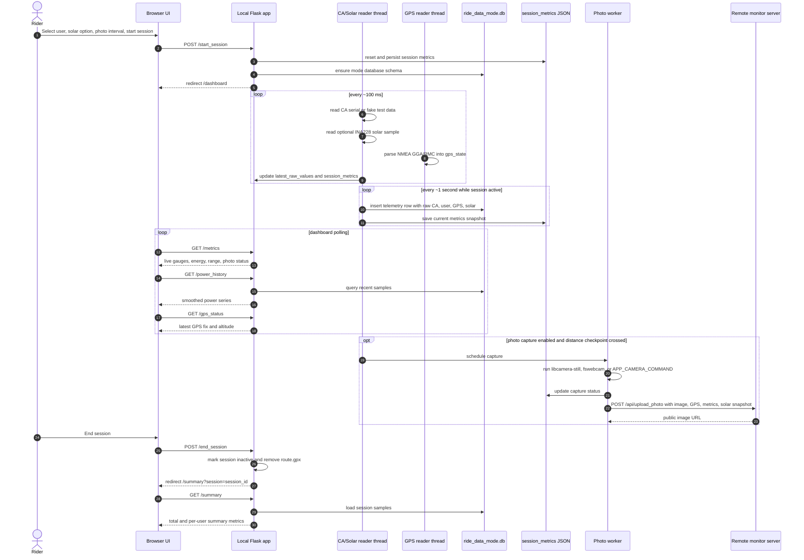
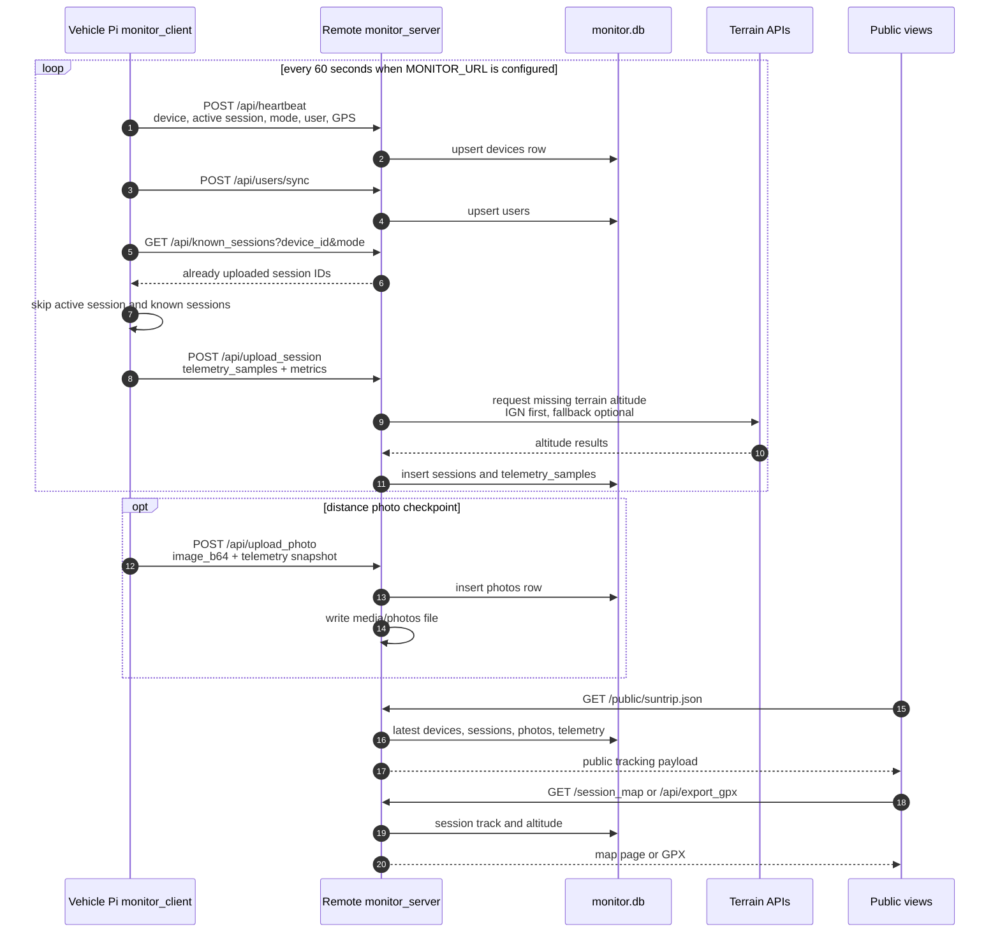
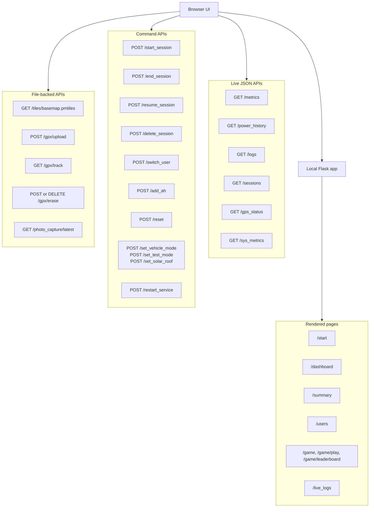

# Cycle Analyst App Solution Diagram

This document maps the current solution, the integrations, and the direction of each data flow.

## System Context

## Local Runtime Flow

## Remote Monitor Sync Flow

## Local Route And Integration Map

## Storage Ownership

| Store | Written by | Read by | Purpose |
| --- | --- | --- | --- |
| `var/ride_data_<mode>.db` | `app.reader`, session row deletion tools | dashboard APIs, summaries, monitor sync | 1 Hz telemetry log per vehicle mode |
| `var/session_metrics/*.json` | metrics/session/photo code | restore, dashboard, monitor sync | Fast current-session metrics snapshot |
| `var/current_session.txt`, `session_state.txt`, `current_user*.txt`, `vehicle_mode.txt`, `test_mode.txt`, `solar_roof.txt` | route handlers and state helpers | startup, route handlers, reader | Runtime state across restarts |
| `var/users.json` | user pages, monitor import/sync | start page, switch user, monitor sync | Local user profiles |
| `var/game_scores.db` | game score endpoint | leaderboard page | Mini-game scores |
| `var/route.gpx` | GPX upload endpoint | map overlay and GPX endpoint | Planned route overlay for dashboard map |
| `var/live_photo/*.jpg` | photo capture worker | `/photo_capture/latest`, dashboard metrics | Local photo preview |
| `var/pending_photos/*` | photo capture worker | monitor sync, photo capture worker | Durable queue for photos waiting for network upload |
| `monitor.db` | monitor server API handlers | monitor pages, public APIs, exports | Aggregated remote telemetry, sessions, devices, users, terrain cache, photos |
| `media/photos` | monitor photo upload | public photo routes | Uploaded camera images |

## Integration Directions

| Integration | Direction | Protocol / trigger | Notes |
| --- | --- | --- | --- |
| Cycle Analyst | Hardware to Pi | Serial line at `SERIAL_PORT` / 9600 baud | Parsed as 15 fields; fake generator replaces it in test mode |
| GPS dongle | Hardware to Pi | NMEA serial, `APP_GPS_PORT`, default `/dev/ttyACM0` | GPS state is kept in memory and copied into each telemetry row |
| INA228 solar | Hardware to Pi | I2C via `smbus2`, enabled by `APP_SOLAR_SENSOR=ina228` | Adds solar current, voltage, power, temperature |
| Camera | Pi to local temp file, then Pi to monitor | `libcamera-still`, `fswebcam`, or `APP_CAMERA_COMMAND`; HTTP upload | Triggered by distance checkpoints when enabled for the session |
| Dashboard | Browser to Pi | HTTP GET/POST plus polling | `/metrics` is high frequency; `/power_history` and `/gps_status` are lower frequency |
| Offline basemap | Browser to Pi to local file | HTTP range requests to `/tiles/basemap.pmtiles` | Falls back to online raster/terrain sources when configured/needed |
| GPX route | Browser to Pi | Multipart upload, GET, POST/DELETE erase | Cleared automatically when the session ends |
| Monitor heartbeat | Pi to monitor | Basic Auth JSON POST `/api/heartbeat` every sync pass | Keeps device presence, active session, GPS, user, and mode fresh |
| Monitor user sync | Pi to monitor and monitor to Pi | Basic Auth JSON GET/POST | Setup page can import remote users; Pi syncs local profiles outward |
| Session upload | Pi to monitor | Basic Auth JSON POST `/api/upload_session` | Only completed sessions are uploaded; known sessions are skipped |
| Photo upload | Pi to monitor | Basic Auth JSON POST `/api/upload_photo` | Includes image, GPS, user, metrics, raw CA, and solar snapshot; failed uploads stay in `var/pending_photos` until a later sync succeeds |
| Terrain enrichment | Monitor to external APIs | HTTPS POST to IGN; optional OpenTopoData fallback | Cached in `terrain_elevation_cache` |
| Public monitor views | Public/browser to monitor | HTTP GET | `/public/suntrip`, `/public/suntrip.json`, `/session_map`, media routes |
| System restart | Browser to Pi | POST `/restart_service`, shell-out to `sudo systemctl restart` | Requires a matching sudoers rule on the Pi |
